# 태양계 시각화 프로젝트

이 프로젝트는 2025학년도 1학기 수학과프로그래밍 기말 과제를 위해 만들어졌습니다.
파이썬을 이용하여 알려진 태양계 행성들의 공전 궤도 반지름, 기울기를 이용하여 태양계의 형태를 3D 이미지로 만드는 것을 목표로 합니다.

---

## 이론적 배경

###  태양계

우리 은하 내에 존재하며, 태양이라는 별(항성)을 중심으로 공전하는 8개 행성들의 모임을 말합니다. 각각의 행성은 이심률이 작은 타원 궤도를 따라 위에서 봤을 때 반시계 방향으로 공전하고 있습니다. 행성들은 태양에서 가까운 순으로 수성, 금성, 지구, 화성, 목성, 토성, 천왕성, 해왕성 이라 불리며, 각각의 궤도는 조금씩 기울어져 있어 모든 궤도가 한 평면을 따라 존재하지 않습니다.

### 태양계 행성의 공전 정보

다음 표는 본 시뮬레이션에 사용된 태양계 행성들의 평균 공전 궤도 반지름(단위: AU)과 궤도 기울기(단위: 도)를 나타냅니다.

| 행성     | 평균 공전 반지름 (AU) | 궤도 기울기 (°) |
|----------|------------------------|------------------|
| 수성     | 0.39                   | 7.0              |
| 금성     | 0.72                   | 3.4              |
| 지구     | 1.00                   | 0.0              |
| 화성     | 1.52                   | 1.9              |
| 목성     | 5.20                   | 1.3              |
| 토성     | 9.58                   | 2.5              |
| 천왕성   | 19.22                  | 0.8              |
| 해왕성   | 30.05                  | 1.8              |

> 📌 참고: AU(Astronomical Unit)는 지구와 태양 사이의 평균 거리(약 1억 5천만 km)를 의미합니다.


---

## 사용한 라이브러리

본 프로젝트에서 태양계 행성 궤도 3D 이미지 구현을 위해 사용한 Python 라이브러리는 다음과 같습니다 :

| 라이브러리 | 사용 목적                   | 설치 명령어                     |
|------------|------------------------------|----------------------------------|
| numpy      | 수치 계산 및 좌표 배열 생성   | `pip install numpy`             |
| plotly     | 3D 시각화 및 인터랙티브 그래프 | `pip install plotly`            |

> `plotly`는 웹 기반 시각화 라이브러리로, 결과는 주피터 노트북 또는 웹 브라우저에서 확인할 수 있습니다.


```python
import numpy as np
import plotly.graph_objects as go
```

---

## 프로젝트

### 1. 태양 및 행성 궤도 시각화 (궤도 기울기 적용 X)

첫 시도로 태양계를 구성하는 요소, 즉 태양의 반지름(~0.00465AU)과 행성들의 궤도 반지름만을 이용하여 태양계의 모습을 구현하여 보았습니다. 그렇게 나타난 결과는 아래와 같습니다.

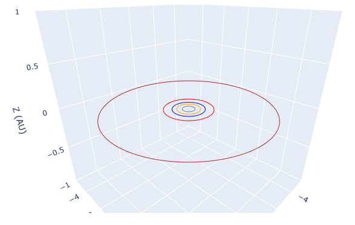

*Fig.1 Total view of Solar system*

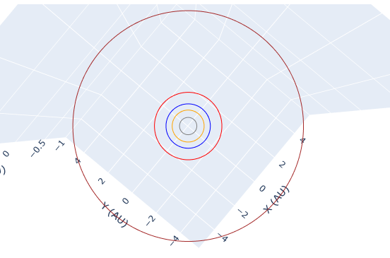

*Fig.2 Top view of Solar system*

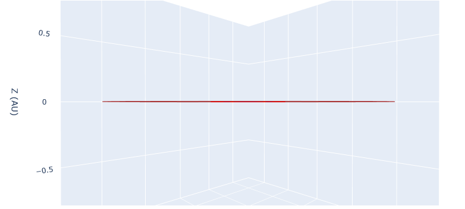

*Fig.3 Side view of Solar system*

Fig.3을 보면 알 수 있듯 행성들의 궤도 기울기를 반영하지 않아 모든 궤도가 겹쳐보이는 것을 확인할 수 있습니다.

### 2. 태양 크기 조절 및 행성 궤도 기울기 반영

1차 시도에서 태양의 실제 크기를 반영하였을 때 나타난 3D 이미지에서 태양이 보이지 않는 것을 확인하였고, 이로 인해 태양의 시각화를 위해서 현실과 다르더라도 어느 정도 크기를 부여하기로 하였습니다. 또한 실제 태양계의 형태에 가깝도록 행성의 공전궤도에 기울기를 반영하는 코드를 추가하였고, 그 결과는 아래와 같습니다.

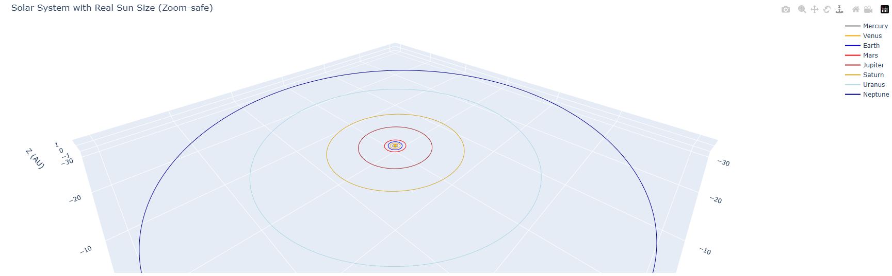

*Fig.4 Total view of Solar system, inclination applied*

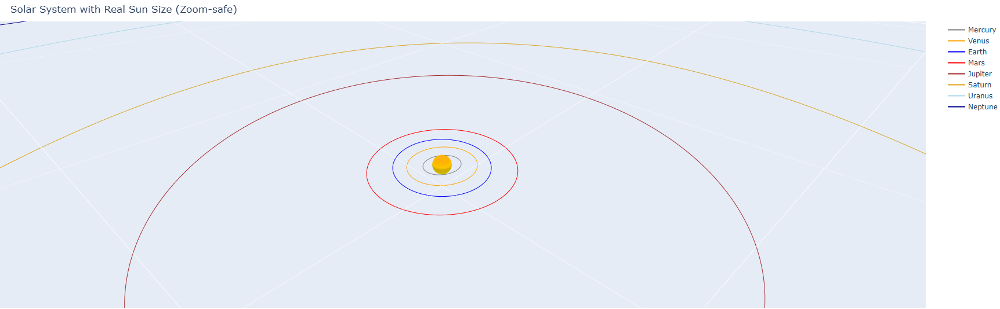

*Fig.5 Total view of Solar system, inclination applied, zoomed*

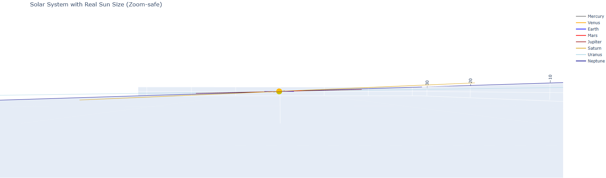

*Fig.6 Side view of Solar system, inclination applied*

Fig.4, Fig.5를 보면 태양이 시각적으로 잘 보이며, 둘을 비교하여 보면 확대를 했을 때 확대 배율에 맞춰 태양의 크기도 변하는 것을 확인할 수 있습니다.
또한 Fig.6을 보았을 때 궤도별로 기울기가 다른 것을 확인할 수 있습니다.

### 3. 행성 위치 추가

2차 시도에서 태양계의 행성의 궤도를 만들었기에, 여기에 대략적인 행성의 위치를 추가하고자 하였습니다. 특정 날짜에서의 행성의 위치를 표현하기 위해 날짜를 다룰 수 있는 datetime 라이브러리를 사용하였습니다.

```python
from datetime import datetime
```

코드를 작성할 때 날짜는 저의 생일인 2004년 12월 14일을 선택하였습니다. 또한, 행성의 실제 크기(AU 단위)를 적용하면 궤도 상에 보이지 않을 것을 감안하여, 2차 시도에서 태양의 크기를 적당히 조절하였듯 행성의 크기들도 비례 관계가 어느정도 성립하도록 수정하였습니다.
> 그로 인해 몇몇 행성이 태양보다 크게 보이는 현상이 나타나지만, 너그럽게 양해해주시면 감사하겠습니다😊

이렇게 코드를 추가하여 나온 결과는 아래와 같습니다.

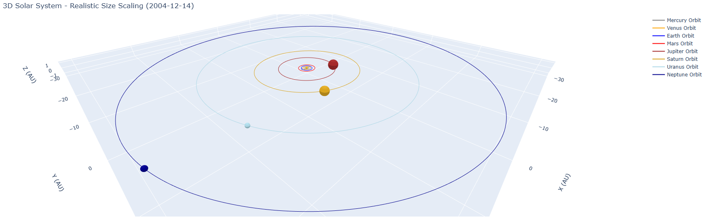

*Fig.7 Total view of Solar system, inclination applied, with planets. <2004-12-14>*

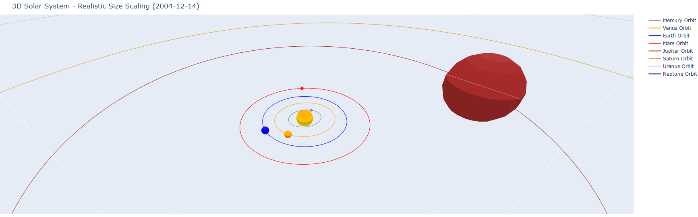

*Fig.8 Total view of Solar system, inclination applied, with planets, zoomed. <2004-12-14>*

### 4. 위성 추가

지구 주위를 돌고 있는 달과 같이, 태양계의 행성 중 일부는 위성을 거느리고 있습니다. 그래서 저는 궤도에 추가된 행성 주위에 위성의 궤도도 시각화를 해보고자 하였습니다.
태양계에는 아래와 같은 위성들이 존재합니다.

|행성   |위성                            |
|-------|--------------------------------|
|지구   |달                              |
|화성   |포보스, 데이모스                |
|목성   |이오, 유로파, 칼리스토, 가니메데|
|토성   |타이탄                          |
|천왕성 |미란다                          |
|해왕성 |트리톤                          |

> 중요한 위성들만 작성하였습니다. 실제로 태양계에 인정된 위성은 181개 이상입니다.

이 많은 위성들 중 가장 중요하다고 여겨지는 지구의 달, 그리고 목성의 4대 위성(이오, 유로파, 가니메데, 칼리스토; 갈릴레이 위성이라고도 불림)만 시각화하였습니다. 시각화를 위해 각 위성의 궤도 반지름을 조사하였고, 그 결과는 아래와 같습니다.

|행성   |위성    |궤도 반지름(AU)|
|-------|--------|--------------- |
|지구   |달      |0.00257         |
|목성   |이오    |0.0028          |
|       |유로파  |0.0045          |
|       |가니메데|0.0072          |
|       |칼리스토|0.0126          |

이 5개 위성의 궤도를 시각화에 사용하기 위해 목성의 크기를 조금 수정하였습니다. 기존 코드에서는 행성들 간의 크기 비율을 유지하는 동시에 궤도에 보이도록 크기가 너무 큰 상태였고, 이로 인해 위성의 궤도를 시각화할 때 행성이 위성의 궤도를 가리는 현상이 나타났습니다. 이 문제를 해결하기 위해 목성의 반지름만 5분의 1로 줄였고, 위성들의 궤도 반지름을 그들 간의 비율은 유지한 채 값을 늘려 시각화하였습니다.
위성 궤도를 추가한 시각화의 결과는 아래 사진과 같습니다.

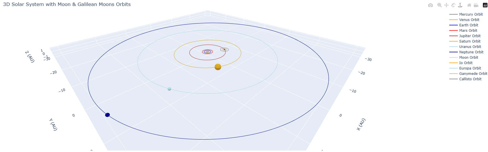

*Fig.9 Total view of Solar system, inclination applied, with planets and orbits of moon and Galilean moons. <2004-12-14>*

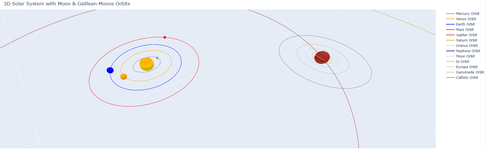

*Fig.10 Total view of Solar system, inclination applied, with planets and orbits of moon and Galilean moons, zoomed. <2004-12-14>*

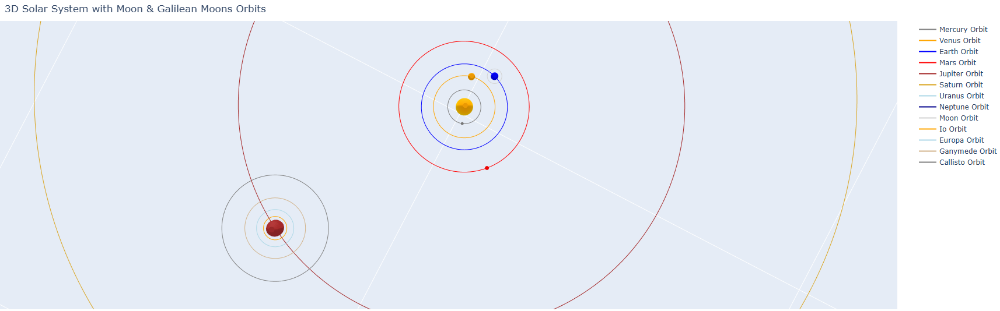

*Fig.11 Top view of Solar system, inclination applied, with planets and orbits of moon and Galilean moons, zoomed. <2004-12-14>*

## 마무리

위의 과정을 통해 태양계 행성의 궤도의 시각화, 태양 크기 조정 및 행성 궤도 기울기 시각화, 행성의 특정 날짜에서의 위치 시각화, 주요 위성 궤도 시각화까지 4개 단계를 거쳐 태양계 시각화 프로젝트를 마무리하였습니다. 작성한 코드는 아래 google colab 링크에서 확인해보실 수 있습니다.

#### Google Colab Link
https://colab.research.google.com/drive/16NFJh9I5U8AIFisVN7eIH_tXw-MkX-tL#scrollTo=SmWLc32NFxz9


